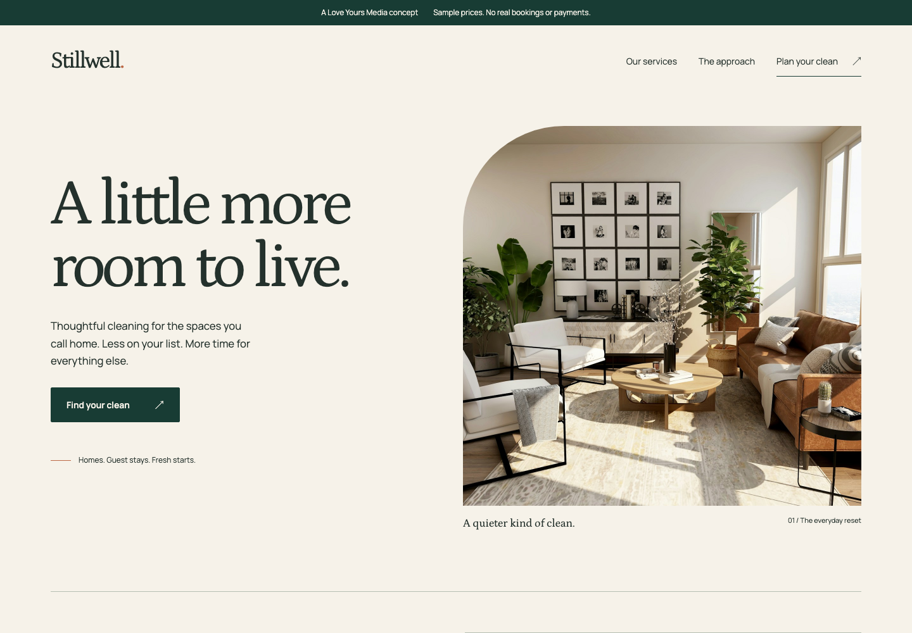
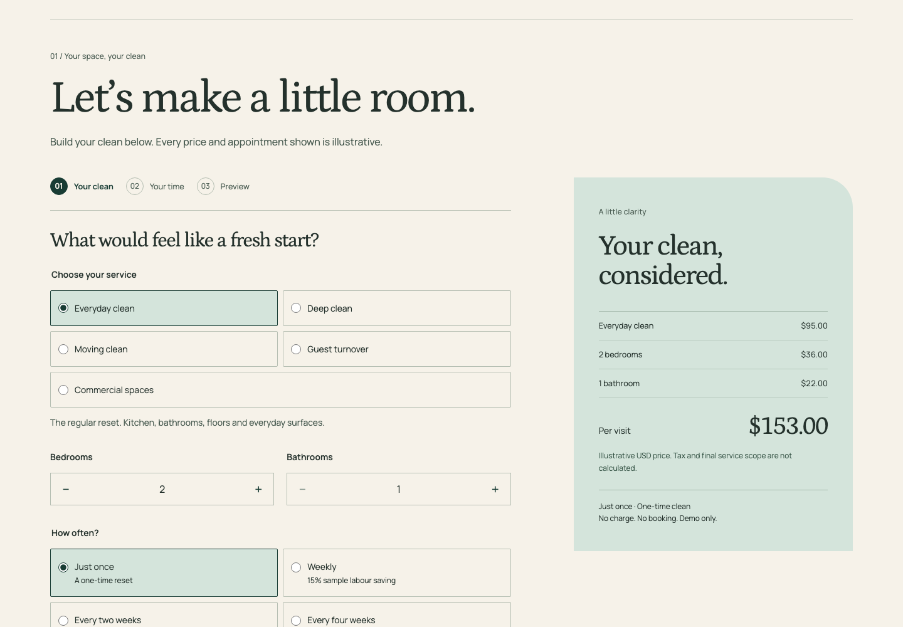
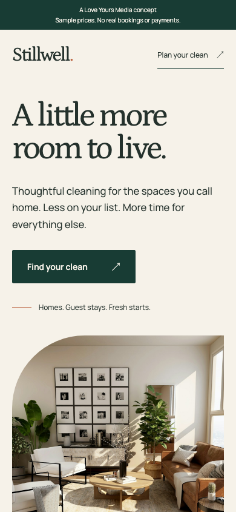

# Stillwell
### A little more room to live.

An original, interactive cleaning-service concept by [Love Yours Media](https://loveyoursmedia.com/).

**[Explore the live concept →](https://preview--stillwell-cleaning-lym.netlify.app/)** · **[Try the estimator →](https://preview--stillwell-cleaning-lym.netlify.app/#estimate)** · **[Browse LYM examples →](https://loveyoursmedia.com/examples/)**

## The idea
Cleaning-service websites often ask visitors to commit before they understand the price or scope. Stillwell makes the service tangible: choose a clean, adjust the property, add the details that matter and see an itemised illustrative estimate before exploring a booking.

A warm, architectural composition pairs Petrona typography with Manrope, forest green, ivory and sage. The original design uses a considered editorial rhythm rather than a generic feature-card template. The configurator follows immediately after the hero, before service and approach sections. The responsive estimator keeps the sample price close to the controls on mobile.

## Explore the journey
1. Everyday, deep, moving or guest-turnover clean.
2. Bedrooms, bathrooms, cleaning frequency and optional extras.
3. Live, itemised sample USD estimate; recurring savings apply to labour only.
4. Simulated dates and arrival windows, with retained back-navigation.
5. One-time or recurring payment summary and a sample CRM handover payload.

Commercial spaces follow an assessment pathway instead of receiving a made-up fixed quote.

## Mobile

## Honest boundaries
Stillwell is a fictional concept, not a real cleaning business, client commission or case study with measured outcomes. All prices and appointment slots are illustrative. No personal or payment details are requested. No bookings, payments, subscriptions, CRM records, emails or notifications are created. No analytics or browser storage is used. The demo's Content Security Policy disables network connections and form submissions.

Photography illustrates interiors, not completed cleaning work, customer properties or staff. Photos are sourced from [Unsplash](https://unsplash.com/license); font files are self-hosted under SIL Open Font Licences. Name clearance and business-authorised content would be required for commercial adoption.

## Validation
Nine Node tests include 1,680 pricing combinations, duplicate add-on handling, invalid input rejection and date-boundary checks. Chromium and WebKit functional journeys were checked at 320, 390, 768 and 1440px widths, including mobile overflow, keyboard radio controls, back/reset, commercial assessment, reduced motion and the absence of network writes or browser storage. These screenshots are viewport captures, not physical-device proof. This is not a formal accessibility certification or real integration test.

## Reuse and source
Brand, services, currency and sample pricing are separately configurable. The full reusable source remains private; this repository contains public design documentation and screenshots only. A production implementation requires a funded scope, approved business rules, authorised integration providers and separate end-to-end launch testing.

© 2026 Love Yours Media. Original interface and implementation rights reserved; third-party assets retain their own licences.
